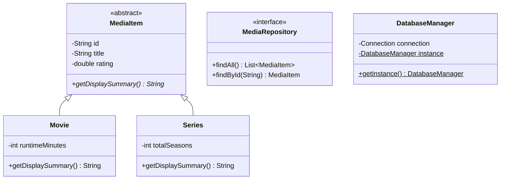

# StreamPulse

StreamPulse is a media catalog and recommendation engine built as a university course evaluation project for "Programming in Java". It simulates a real-world streaming platform backend, demonstrating a comprehensive understanding of core and advanced Java concepts.

## Architecture and Core Concepts

This project heavily utilizes Object-Oriented principles and modern Java features to meet academic requirements:

### 1. Object-Oriented Programming (OOP)
- **Inheritance & Abstract Classes**: `MediaItem` acts as the abstract base for `Movie` and `Series`, promoting code reuse and establishing a clear hierarchy.
- **Polymorphism**: The `MediaRepository` interface allows interchangeable implementations (like `FileMediaRepository`). Overridden methods such as `getDisplaySummary()` provide polymorphic behavior across different media types.
- **Encapsulation**: Strict use of access modifiers ensures data hiding, with data exposed only via appropriate getters/setters.

### 2. Data Structures & Collections Framework
- **Lists**: Uses `ArrayList` for ordered, index-based storage of general media lists.
- **Maps**: Employs `HashMap` for fast key-value lookups (e.g., mapping ratings or genres to specific items).
- **Sets**: Utilizes `TreeSet` with custom `Comparator` implementations to maintain automatically ordered watchlists.

### 3. Concurrency & Multithreading
- **Parallel Processing**: `ExecutorService` and `Callable` are used to compute similarities in parallel, drastically reducing recommendation generation time on large catalogs (e.g., parallelized Cosine Similarity calculations).

### 4. File I/O & Exception Handling
- **Data Parsing**: Robust File I/O is implemented using `BufferedReader` and `FileReader` to parse media items from a CSV seed file during initialization.
- **Exception Management**: Custom exception classes and comprehensive `try-catch-finally` blocks (or try-with-resources) are used throughout to gracefully handle `IOException`, `SQLException`, and parsing errors without crashing the application.

### 5. Database Connectivity (JDBC)
- **SQLite Integration**: Persists user data and watchlists using JDBC.
- **Design Patterns**: Follows the Singleton pattern in `DatabaseManager` to ensure a single, thread-safe connection instance.

### 6. Java Streams API
- **Analytics**: Utilized in `AnalyticsService` for declarative data processing, filtering, and mapping (e.g., calculating average ratings or finding favorite genres).

## High-Level Class Diagram



## Setup Instructions

### Prerequisites
- JDK 17 or higher
- Maven 3.6+

### Build the Project
Clone the repository and compile the project using Maven:
```bash
mvn clean compile
```

### Run the Application
Start the interactive CLI:
```bash
mvn exec:java
```

### Testing
Run the JUnit 5 test suite to verify core logic:
```bash
mvn test
```
